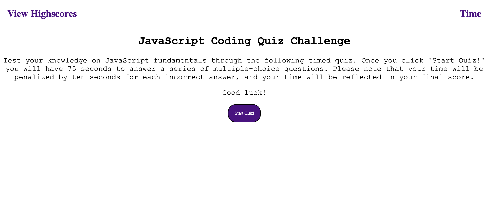

# JavaScript Coding Quiz Challenge

## Link to Deployed Webpage 
To view the JavaScript Coding Quiz Challenge web application, please visit the following link: https://mackenzie-wentworth.github.io/timed-coding-quiz/

## The Task
For this week's challenge, I was tasked to build a code from scratch to create a timed coding quiz for users to test their knowledge on JavaScript fundamentals. To produce the styling and functionality of the web application, I used JavaScript and CSS with HTML to include the following items:

* Beginning homescreen with instructions and a 'start' button to begin the timed quiz
* Upon clicking the 'start button,' the user is then presented with the first question and the timer begins a countdown from 75 seconds
* When a question is answered incorrectly, then the user is penalized by ten seconds which is subtracted from the timer countdown
* When  the user has answered all questions or the time reaches 0 seconds left, then the quiz is over
* Once the quiz is over, the user is presented with the final score, where they can also type in their intials to save their score
* All scores logged with initials, will be saved to local storage to compare knowledge progress
* When the user refreshes the web page, the quiz will navigate to the beginning homescreen where the user can take the quiz again by clicking the 'start' button

## Mock-Up

The following image displays the web application's homescreen appearance before a user starts the JavaScript Coding Quiz Challenge.

## Credits

### JavaScript Questions:
All questions featured in the timed coding quiz were gathered from https://www.javatpoint.com/javascript-mcq.
